> # 0. 요약

# 간단한 LMS 시스템 (교수-학생 간의 웹소켓 통신)

#### 소프트웨어학부 20193449 강준호

- 이 프로젝트는 웹소켓을 이용한 교수와 학생 간의 실시간 통신 시스템을 구현한 것입니다.
- 주요 기능은 교수와 학생 간의 메시지 송수신, 1:1 대화, 파일 전송 등을 포함합니다.
- 이를 통해 교수는 학생에게 공지사항이나 자료를 즉시 전달할 수 있고, 학생들은 실시간으로 질문을 하거나 자료를 받을 수 있습니다.

---

> # 1. 서론

### 주제 선정 배경 및 필요성

- 소켓 네트워크 프로그래밍을 활용하여 교수와 학생 간의 실시간 채팅 서비스를 구현하는 것을 목표로 하고 있습니다.
- LMS는 매일 사용하는 서비스로, 한 학기 동안 배운 소켓 프로그래밍을 이용하면 비슷한 기능을 구현할 수 있을 것이라고 생각했습니다.

### 구현물의 특징, 장점 및 기여도

- 특징: 실시간 메시지 송수신, 브로드캐스트, 1:1 대화, 파일 전송
- 장점: 소통의 효율성 증대, 즉각적인 피드백 제공, 학습 자료의 빠른 전달

---

> # 2. 배경지식

### 프로젝트를 이해하는데 필요한 배경지식 기술 - 예: 개발환경, 사용된 프로토콜, 라이브러리 등

- 개발환경 : macOs(sonoma 14.4)
- 사용된 프로토콜: TCP/UDP
- 라이브러리: pthread, mutex_lock, socket 등

---

> # 3. 프로젝트 설명

### 프로젝트 구현물에 대한 개념도

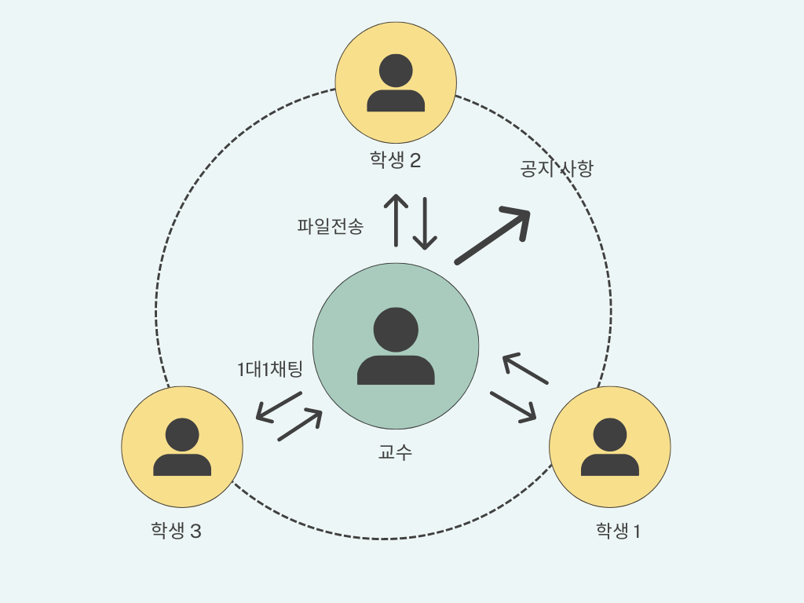

- 이 프로젝트는 클라이언트(학생)와 서버(교수)로 구성되며, 웹소켓을 통해 상호 통신합니다.

### 시스템 구성에 대한 도식화 및 모듈별 설명 기재

### 기능 사용설명

#### 브로드캐스트 (교수 -> 모든 학생)

- 교수는 연결된 모든 학생에게 메시지를 브로드캐스트할 수 있습니다. 교수 클라이언트 터미널에 메시지를 입력하면, 해당 메시지가 모든 클라이언트(학생)에게 전송됩니다.

#### 1:1 대화 (교수 <-> 특정 학생)

- 학생은 기본적으로 교수와 1대1 메세지만 사용가능합니다.

- 교수는 기본적으로 브로드 캐스트를 사용하지만, 특정 학생을 학번으로 지목해 1대1 메시지를 보낼 수 있습니다.
- 사용 방법은 아래와 같습니다.

```bash
sendto: student_id message
```

#### 파일 전송 (교수 학생 공통)

- 교수와 학생은 모두 서버에 파일 전송을 할 수 있습니다. 이를통해 과제나 교안을 제출합니다.
- 제출물들은 serverFiles라는 디렉토리에 저장됩니다.
- 사용 방법은 아래와 같습니다:

```bash
sendfile: file_name
```

---

> # 4. 결과분석

### 실행(사용)방법 및 순서, 실행화면 - 복잡도, 지연시간, 자원소모량 등 - 동영상 (선택)

#### 실행화면

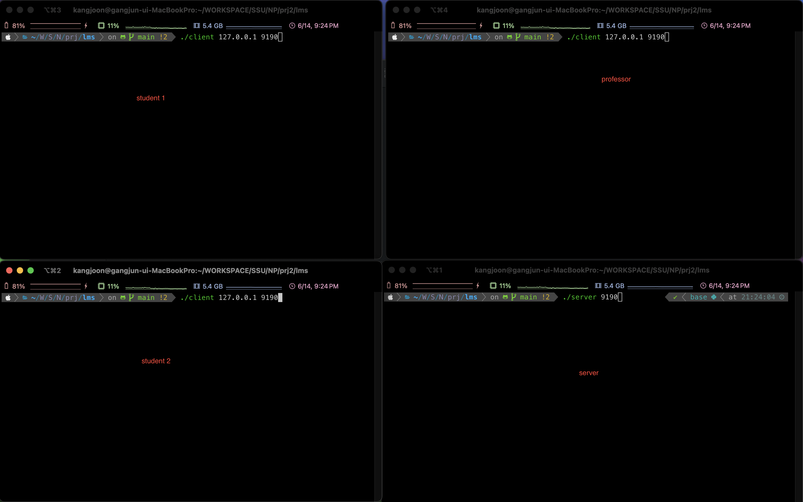

- 시작 커맨드

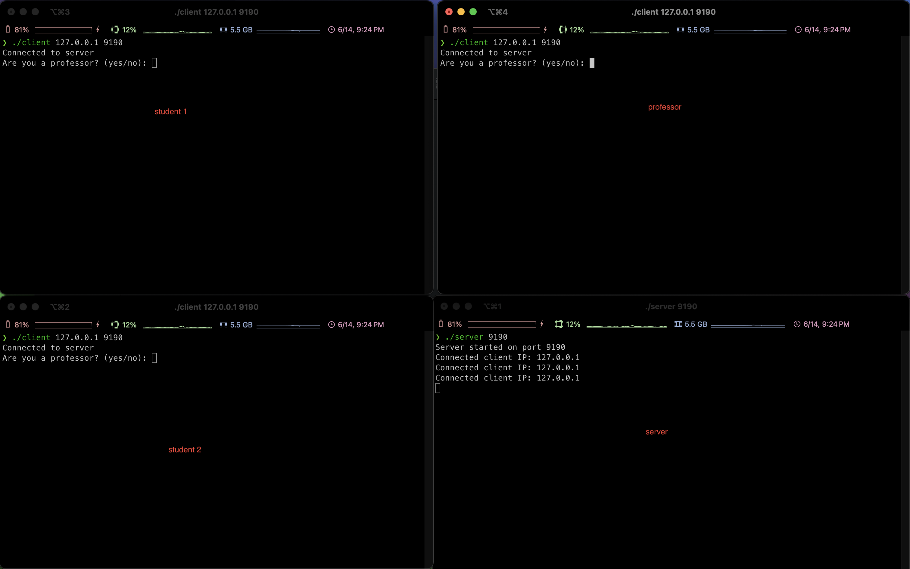

- 서버 1개, 클라이언트 3개를 실행시켰다

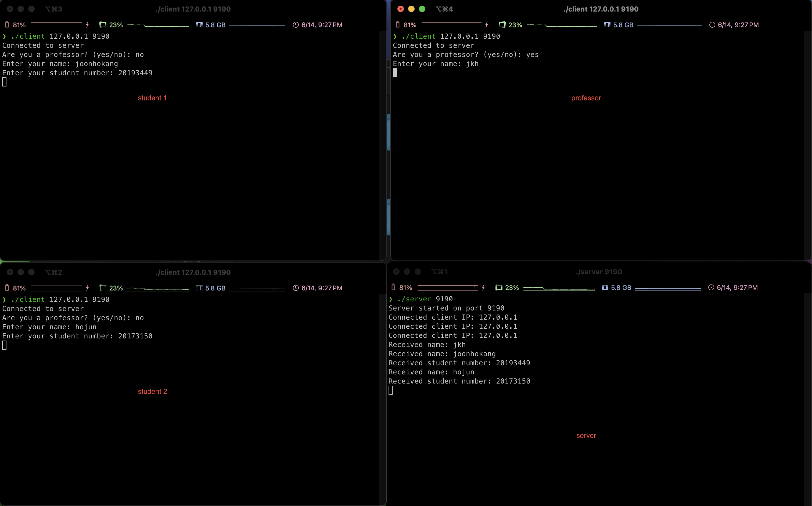

- 서버1, 교수(jkh), 학생1(joonhokang/20193449), 학생2(hojun/20173150)

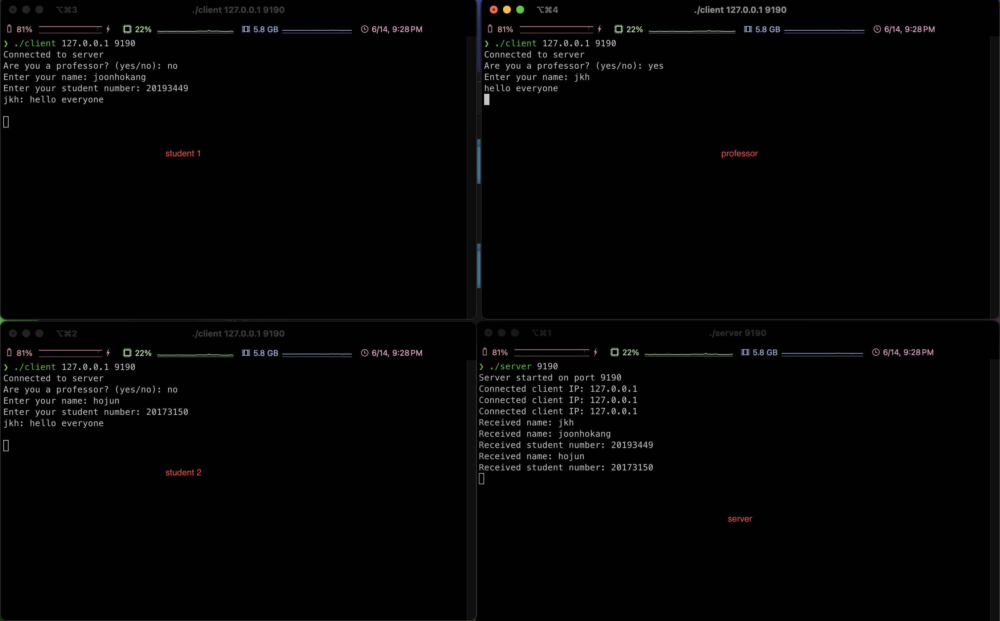

- 교수의 브로드 캐스트

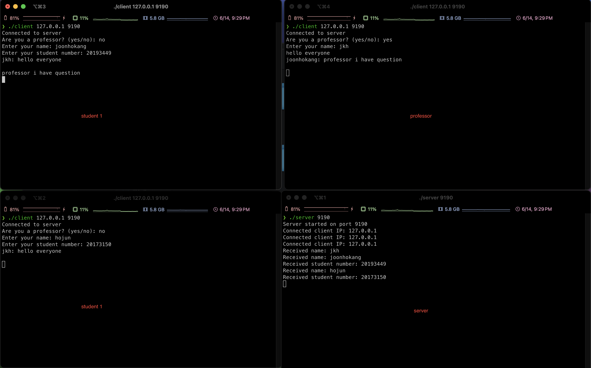

- 학생1의 교수와 1대1 대화. 학생 2 는 들을 수 없다.

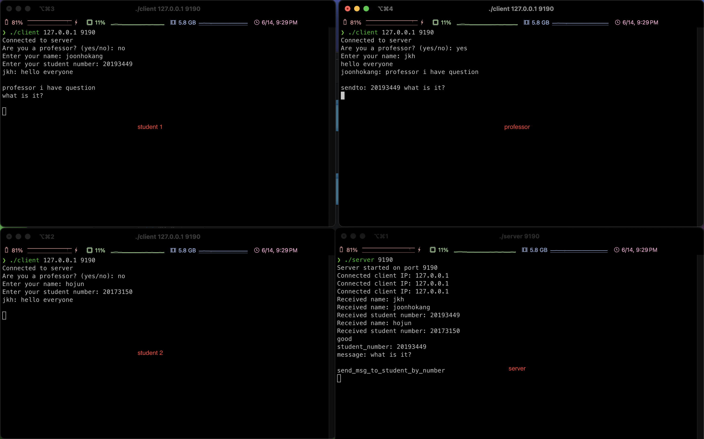

- 교수와 학생1의 1대 1 대화. 학생 2는 들을 수 없다.

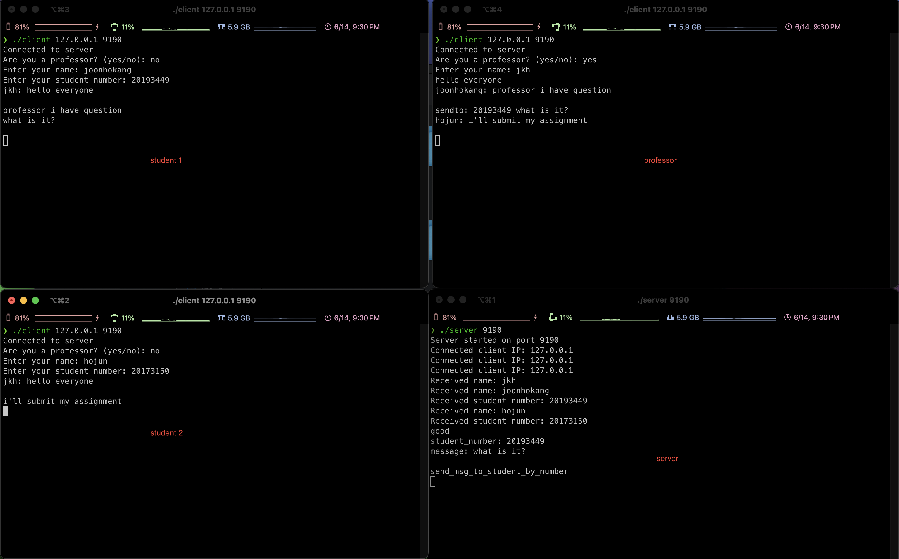

- 학생2와 교수와 1대1 대화.

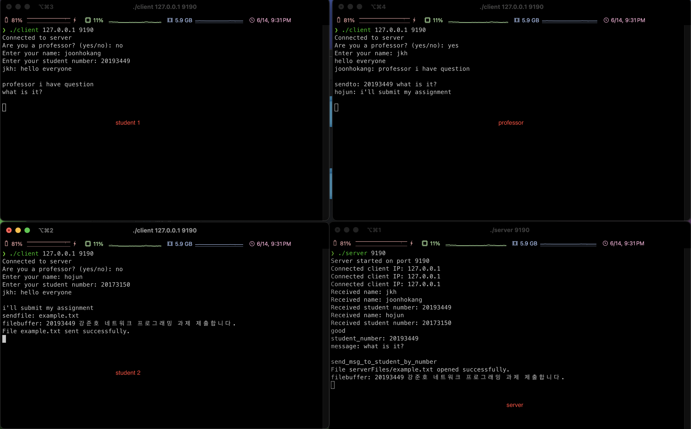

- 학생2가 example.txt 파일을 전송했다.

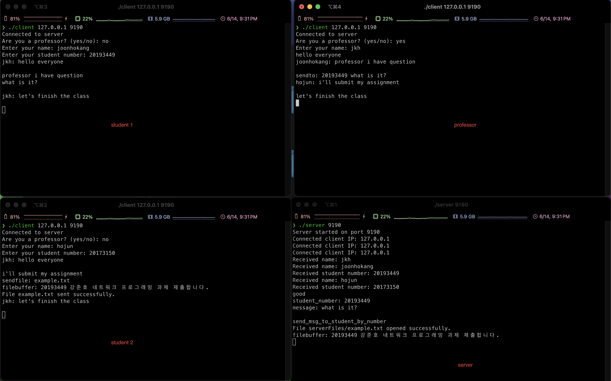

- 교수의 브로드 캐스트

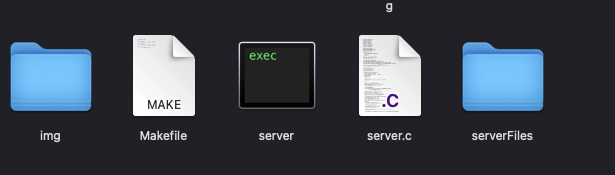

- serverFiles라는 이름의 하위 디렉토리가 생성된다.

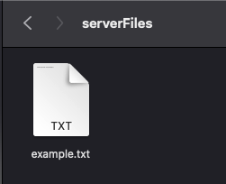

- 이곳에 전송한 파일이 저장된다.

---

> # 5. 한계점 및 개선 가능성

- LMS 시스템을 더 구체적으로 구현하고 싶었으나, 시간적 한계가 있었습니다.
- 수업 시간에 배운 보안 개념을 적용하지 못한 점이 아쉽습니다.
- 다양한 파일 형식을 전송할 수 있도록 개선이 필요합니다.
- 최대 몇 명의 학생까지 연결이 가능한지 성능 분석 및 실험이 필요합니다.

- 추가적으로 파일전송은 완료되었지만, 파일의 내용이 작성되지 않는 오류가 마지막에 발생했습니다. 이를 해결하려고 했지만 시간이 부족해 아쉽게 해결하지 못했습니다.

> # 6. 결론

- 이 프로젝트는 웹소켓을 이용한 실시간 통신 시스템으로, LMS 시스템을 모방하여 교수와 학생 간의 원활한 소통을 가능하게 합니다.
- 교수는 1:N 브로드캐스트, 특정 학생(학번으로 구분)과의 1:1 대화, 파일 전송 등을 할 수 있습니다.
- 학생은 교수와 1:1 대화 및 파일 전송이 가능합니다.
- 향후 보안 강화 및 추가 기능 개발을 통해 더욱 향상된 LMS 시스템으로 발전할 수 있을 것입니다.
